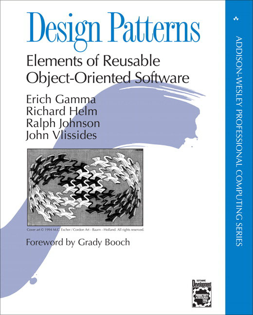

## The Black Box
A design pattern is essentially a fancy way of saying copy and paste.  Generally speaking, a design pattern is a solution, or set of solutions, for a common reoccurring problem.  The question you might be asking is "Why would you have a reoccurring problem and not solve it once and be done?".  The answer to this question is very simple in that it's to teach newbies and act as a platform to learn about a problem.  I like to think of a design pattern as a black box as referenced in algebra when discussing functions.  Many mathematicians will refer to a formula that performs some calculation as a "black box" that takes an input and spits out the answer.  This is very similar to a design patter because many people who are learning a new idea in software design can use the "black box" to get the same or desired result.

## Continuing Success
Over the course of the semester, we have been using design patterns constantly.  We have applied the factory method in our learning process of meteor and react when we were doing the digits assignment.  Another design pattern that we've used is the observer pattern when using underscore and learning about interfacing with a large set of data.  There are many other types of design patterns that we may have used, however design patterns are constantly changing as technology advances and there is no permanent design pattern.  Using these design patterns we have been able to expedite our learning process.  While we have not learned the specific details of "how" many of these feature work, using design patterns we are able to achieve success regardless.
