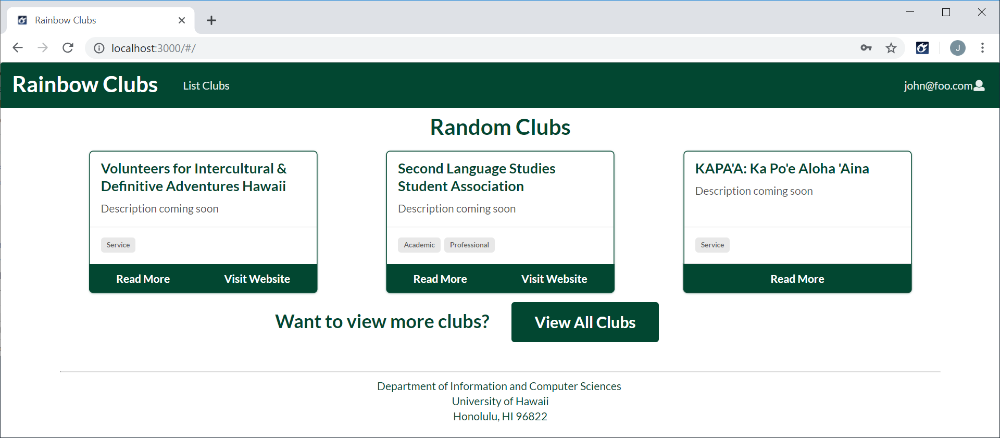
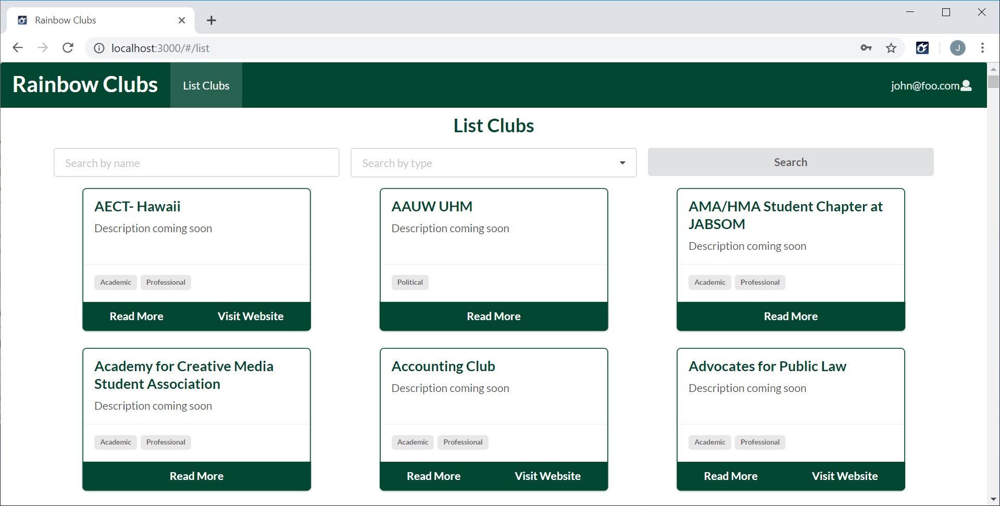
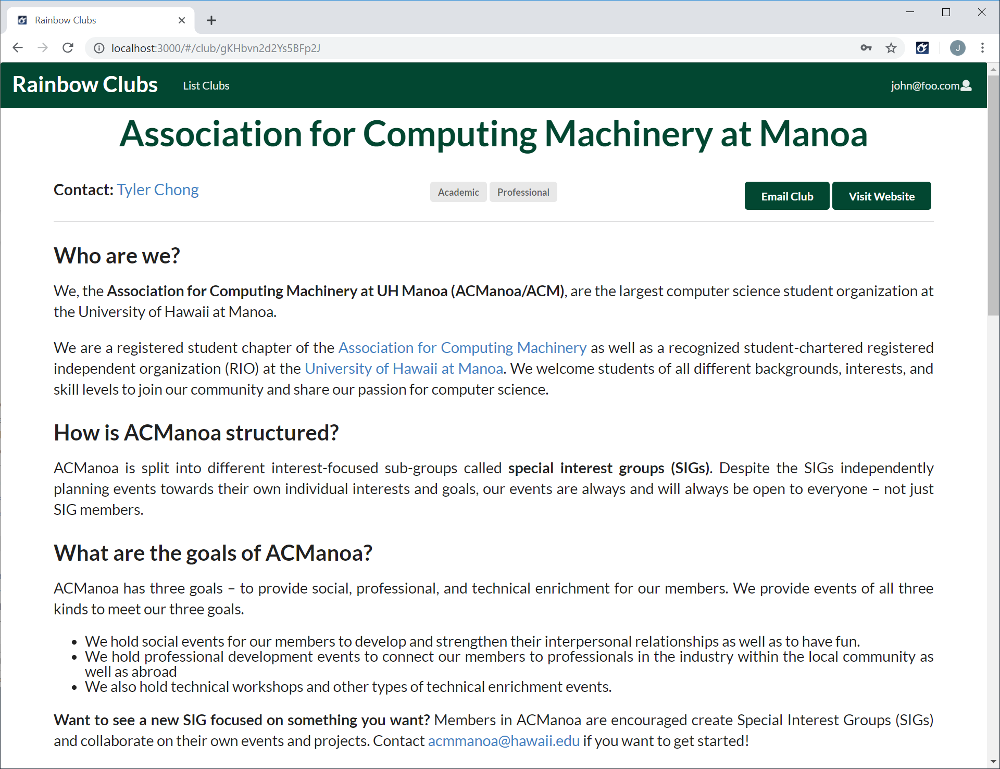

[Rainbow Clubs Page](https://rainbowclubs.github.io/)

##The Problem
The issue that we faced is that there is currently no website or interface that allows students to easily access the clubs and special interest groups at UH Manoa.  Therefore we wanted to create a website that would allow students to do just that.  

##The Solution
We have created a website that utilizes React and Meteor to be user-friendly and easily manageable.  The website consists of a various number of pages each with a specific purpose.  
- Landing:
The landing page is the page that normal users will see when they first arrive at the website.  This page will describe what the website does and gives examples of how it can be used.

- Home Page:
Depending on what type of user you are, the home page will either display various clubs that align with the user settings or, if the user is an admin or moderator user, will display moderator functions such as managing reviews for clubs and approving club changes.  

- Club Listing:
This page will list all known available clubs and some additional information.

- Club Page:
This is the sample page of what a club would look like.  There will also be reviews located at the bottom of the page.

##Conclusion
I feel that I have done my fair share of the work for the group and did not feel that I was lacking no leading in effort.  I feel that as a group we were able to accomplish what we wanted to do however there were some bumps in the road when getting there.  I was in charge of creating the club page as well as the reviews section.  I also did some small changes such as appearance and colors.  I learned a fair amount of React and Meteor from this experience as it was the primary program used.  I also learned much about working as a group and that I personally do not enjoy it as much however I have learned skills that help with any issues that arise.  
